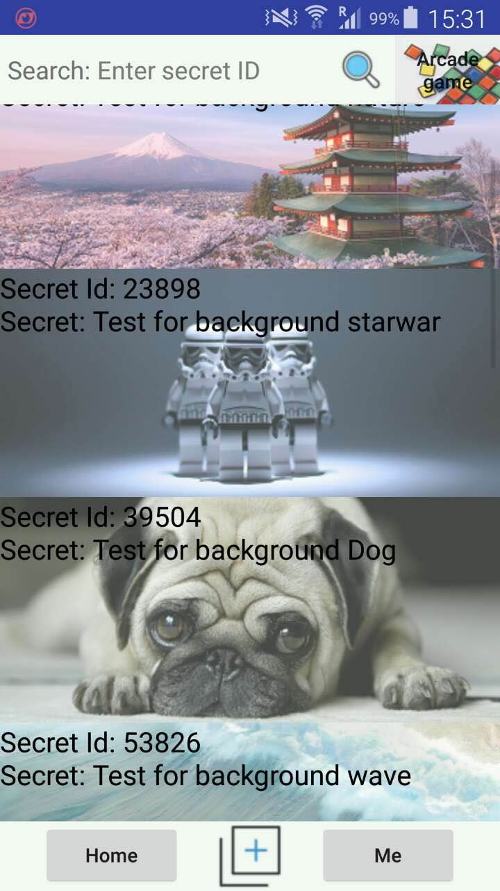

# Secret Keeper
This is a fantanstic app we developed in AUT's Software Development Practice course (SDP). The method we used to develope this app is agile. And scrum is the framework.

The app is used for people to store their secret. The interesting feature is that people can also exchange their secret and view other people's secret anonymously by searching the secret ID. Also there are some little game inside to let the customer play to unlock other people's secret.

##Team
### 1. Team member
* Tao Li (Scrum Master, developer)
* Harry Zhu (Product Owner, developer)
* Nan Jiang (Main developer)
* Su Kim Troung (developer)

### [2. Scrum board](https://trello.com/b/vbAbuBhH/stream-51-group-4-secret-keeper)
In the developing process we use trello as our Scrum board also the project management board.
 

### 3. Development Evironment
* Android Studio as IDE
* Genymotion as Android Emulation
* SDK 21
* Language: Java

### 4. Method and tools
* Agile
* INVEST
* DEEP
* TDD
* Planning Poker

##Sprint 1
### [1. Sprint 1 short demo](https://www.youtube.com/watch?v=6piqmtke5VQ)
*Click Below to open the youtube Link*

### [2. Sprint 1 Presentation video](https://www.youtube.com/watch?v=8SRWN1mqAus)
*Click Below to open the youtube Link*

##Sprint 2 (Final deliverable - App Showcase)
### Login Page

### Register Page

### Main Page

### Secret Page

### My Posted Secret Page

### Post Page

### Game Page

